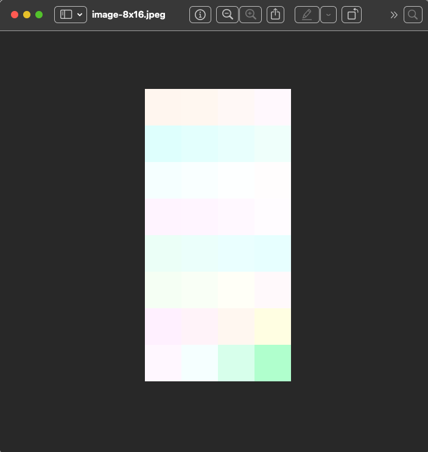
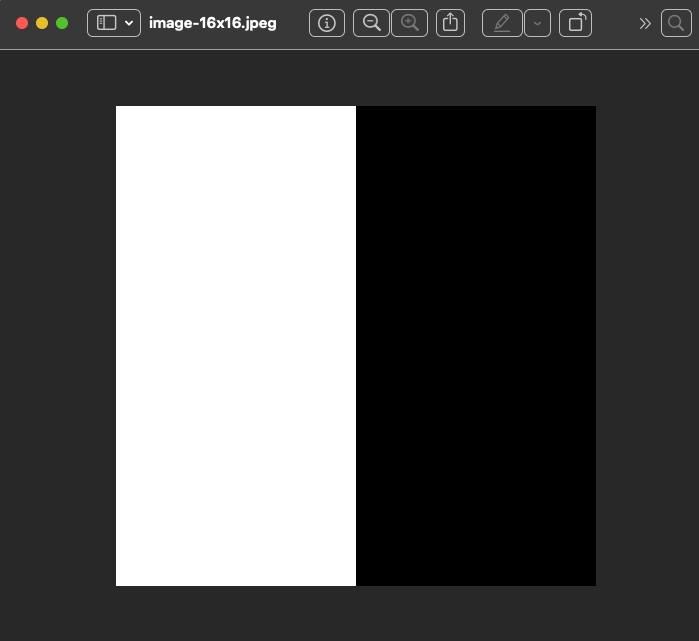

## Preamble

`YuvImage.compressToJpeg()` produces JPEGs with ringing (or similar) artifacts when the image width is not divisible
by 16.

This behavior occurs with any resolution where the width is not divisible by 16, including the commonly used 1080x1920.
The issue was originally discovered using YUV images from CameraX.

The underlying library, `libjpeg-turbo`, is expected to handle such cases by padding the image with black pixels.
You can find evidence of this behavior in
the [source code](https://github.com/libjpeg-turbo/libjpeg-turbo/blob/2a0c86278249e7a3c3429caff24c06a50048d772/src/jccoefct.c#L182)
of the function that is called internally by `YuvImage.compressToJpeg()`.

Additionally, I recompiled `libjpeg-turbo` with logging enabled, replaced the library on an AOSP device, and confirmed
that the padding logic is indeed executed when the image width is not divisible by 16.
Nevertheless, the final JPEG still shows ringing (or similar) artifacts.

I also added a test case where the dummy black pixels are included as part of the original image itself. In that case,
no artifacts are present.

## How to Test

The relevant test code is located under `app/src/androidTest`. To execute these tests, please follow these steps in 
Android Studio:

- Navigate to the directory `app/src/androidTest`.
- Right-click on the `androidTest` folder.
- Select "Run 'All Tests'" from the context menu. 

The resulting JPEGs can be found on the device at the following path: `Pictures/TestDebug`. Also, you can find these 
images in [jpegs](jpegs) folder in the project.
